# Database ER Diagram

> Generated automatically from Sequelize models.
> Do not edit this diagram manually.

- Models: 33
- Foreign-key relationships: 39
- Many-to-many relationships: 0

## Relationship legend

The symbol next to an entity says how many of that entity can relate to one entity at the other end. Symbols are mirrored on the left and right.

- `||` = exactly **1**.
- `|o` (left) or `o|` (right) = **0..1** (optional).
- `}o` (left) or `o{` (right) = **0..N** (zero or many).
- `}|` (left) or `|{` (right) = **1..N** (at least one).

Examples:

- `Parent ||--o{ Child` = **1:N**: each child has exactly one parent; a parent can have zero or many children.
- `Parent |o--o{ Child` = **1:N with an optional parent**: each child has zero or one parent; a parent can have zero or many children.
- `Parent ||--o| Child` = **1:1**: each child has exactly one parent; a parent can have zero or one child.
- `A }o--o{ B` = **N:N**: both sides can have zero or many matches, via a junction table.

Line labels name the Sequelize association and its foreign key. **PK** = primary key, **FK** = foreign key, **UK** = unique key. Cardinalities reflect the model declarations; a collection is shown as optional because declaring an association does not require a parent to have children.

## Diagram

```mermaid
erDiagram
  direction LR

  Activities {
    INTEGER id PK,FK,UK "AUTO INCREMENT"
    INTEGER hr_backup_id
    TIMESTAMP_WITH_TIME_ZONE periode "NOT NULL"
    INTEGER contentieux_id
    INTEGER entrees
    INTEGER sorties
    INTEGER stock
    INTEGER original_entrees
    INTEGER original_sorties
    INTEGER original_stock
    TIMESTAMP_WITH_TIME_ZONE created_at "NOT NULL"
    TIMESTAMP_WITH_TIME_ZONE updated_at "NOT NULL"
    TIMESTAMP_WITH_TIME_ZONE deleted_at
  }

  Comments {
    INTEGER id PK,UK "AUTO INCREMENT"
    VARCHAR_255 type "NOT NULL"
    TEXT comment
    INTEGER user_id "NOT NULL"
    INTEGER hr_backup_id "NOT NULL"
    TIMESTAMP_WITH_TIME_ZONE created_at "NOT NULL"
    TIMESTAMP_WITH_TIME_ZONE updated_at "NOT NULL"
    TIMESTAMP_WITH_TIME_ZONE deleted_at
  }

  CompetenceMappings {
    INTEGER id PK,UK "AUTO INCREMENT"
    INTEGER code_nac "NOT NULL"
    INTEGER rh_position_id "NOT NULL"
    TIMESTAMP_WITH_TIME_ZONE created_at "NOT NULL"
    TIMESTAMP_WITH_TIME_ZONE updated_at "NOT NULL"
    TIMESTAMP_WITH_TIME_ZONE deleted_at
  }

  ContentieuxOptions {
    INTEGER id PK,UK "AUTO INCREMENT"
    INTEGER contentieux_id
    DOUBLE_PRECISION average_processing_time
    INTEGER backup_id
    TIMESTAMP_WITH_TIME_ZONE created_at "NOT NULL"
    TIMESTAMP_WITH_TIME_ZONE updated_at "NOT NULL"
    TIMESTAMP_WITH_TIME_ZONE deleted_at
    DOUBLE_PRECISION average_processing_time_fonc
  }

  ContentieuxReferentiels {
    INTEGER id PK,FK,UK "AUTO INCREMENT"
    VARCHAR_255 label
    VARCHAR_255 code_import
    INTEGER parent_id
    INTEGER rank
    VARCHAR_255 value_quality_in
    VARCHAR_255 value_quality_out
    VARCHAR_255 value_quality_stock
    TEXT help_url
    BOOLEAN compter
    INTEGER only_to_hr_backup
    VARCHAR_255 category
    BOOLEAN check_ventilation "NOT NULL"
    TIMESTAMP_WITH_TIME_ZONE created_at "NOT NULL"
    TIMESTAMP_WITH_TIME_ZONE updated_at "NOT NULL"
    TIMESTAMP_WITH_TIME_ZONE deleted_at
  }

  Groups {
    INTEGER id PK,FK,UK "AUTO INCREMENT"
    VARCHAR_255 label "NOT NULL"
    TIMESTAMP_WITH_TIME_ZONE created_at "NOT NULL"
    TIMESTAMP_WITH_TIME_ZONE updated_at "NOT NULL"
    TIMESTAMP_WITH_TIME_ZONE deleted_at
  }

  HistoriesActivitiesUpdate {
    INTEGER id PK,UK "AUTO INCREMENT"
    INTEGER activity_id "NOT NULL"
    VARCHAR_255 activity_node_updated
    INTEGER user_id "NOT NULL"
    FLOAT value
    TIMESTAMP_WITH_TIME_ZONE created_at "NOT NULL"
    TIMESTAMP_WITH_TIME_ZONE updated_at "NOT NULL"
    TIMESTAMP_WITH_TIME_ZONE deleted_at
  }

  HistoriesContentieuxUpdate {
    INTEGER id PK,UK "AUTO INCREMENT"
    INTEGER backup_id "NOT NULL"
    INTEGER user_id "NOT NULL"
    TIMESTAMP_WITH_TIME_ZONE created_at "NOT NULL"
    TIMESTAMP_WITH_TIME_ZONE updated_at "NOT NULL"
    TIMESTAMP_WITH_TIME_ZONE deleted_at
  }

  HRActivities {
    INTEGER id PK,UK "AUTO INCREMENT"
    INTEGER hr_situation_id FK "NOT NULL"
    INTEGER nac_id "NOT NULL"
    FLOAT percent "NOT NULL"
    TIMESTAMP_WITH_TIME_ZONE created_at "NOT NULL"
    TIMESTAMP_WITH_TIME_ZONE updated_at "NOT NULL"
    TIMESTAMP_WITH_TIME_ZONE deleted_at
  }

  HRBackups {
    INTEGER id PK,FK,UK "AUTO INCREMENT"
    VARCHAR_255 label "NOT NULL"
    BOOLEAN jirs
    BOOLEAN stat_exclusion
    INTEGER group
    INTEGER group_id
    INTEGER group_id_rank
    TIMESTAMP_WITH_TIME_ZONE created_at "NOT NULL"
    TIMESTAMP_WITH_TIME_ZONE updated_at "NOT NULL"
    TIMESTAMP_WITH_TIME_ZONE deleted_at
  }

  HRBackupsGroups {
    INTEGER id PK,FK,UK "AUTO INCREMENT"
    VARCHAR_255 label "NOT NULL"
    TIMESTAMP_WITH_TIME_ZONE created_at "NOT NULL"
    TIMESTAMP_WITH_TIME_ZONE updated_at "NOT NULL"
    TIMESTAMP_WITH_TIME_ZONE deleted_at
  }

  HRBackupsGroupsIds {
    INTEGER id PK,UK "AUTO INCREMENT"
    INTEGER hr_backup_group_id "NOT NULL"
    INTEGER hr_backup_id FK "NOT NULL"
    TIMESTAMP_WITH_TIME_ZONE created_at "NOT NULL"
    TIMESTAMP_WITH_TIME_ZONE updated_at "NOT NULL"
    TIMESTAMP_WITH_TIME_ZONE deleted_at
  }

  HRBackupsSettings {
    INTEGER id PK,UK "AUTO INCREMENT"
    INTEGER backup_id "NOT NULL"
    VARCHAR_255 label "NOT NULL"
    VARCHAR_255 type "NOT NULL"
    TEXT datas
    TIMESTAMP_WITH_TIME_ZONE created_at "NOT NULL"
    TIMESTAMP_WITH_TIME_ZONE updated_at "NOT NULL"
    TIMESTAMP_WITH_TIME_ZONE deleted_at
  }

  HRCategories {
    INTEGER id PK,FK,UK "AUTO INCREMENT"
    VARCHAR_255 label "NOT NULL"
    INTEGER rank
    TIMESTAMP_WITH_TIME_ZONE created_at "NOT NULL"
    TIMESTAMP_WITH_TIME_ZONE updated_at "NOT NULL"
    TIMESTAMP_WITH_TIME_ZONE deleted_at
  }

  HRComments {
    INTEGER id PK,UK "AUTO INCREMENT"
    INTEGER human_id FK "NOT NULL"
    TEXT comment
    INTEGER user_id "NOT NULL"
    TIMESTAMP_WITH_TIME_ZONE created_at "NOT NULL"
    TIMESTAMP_WITH_TIME_ZONE updated_at "NOT NULL"
    TIMESTAMP_WITH_TIME_ZONE deleted_at
  }

  HRFonctions {
    INTEGER id PK,FK,UK "AUTO INCREMENT"
    VARCHAR_255 code
    VARCHAR_255 label "NOT NULL"
    INTEGER rank
    INTEGER category_id
    VARCHAR_255 category_detail
    TIMESTAMP_WITH_TIME_ZONE min_date_avalaible
    VARCHAR_255 recoded_function
    TIMESTAMP_WITH_TIME_ZONE created_at "NOT NULL"
    TIMESTAMP_WITH_TIME_ZONE updated_at "NOT NULL"
    TIMESTAMP_WITH_TIME_ZONE deleted_at
    BOOLEAN calculatrice_is_active
    VARCHAR_255 position
  }

  HRIndisponibilities {
    INTEGER id PK,UK "AUTO INCREMENT"
    INTEGER hr_id FK "NOT NULL"
    INTEGER nac_id "NOT NULL"
    FLOAT percent "NOT NULL"
    TIMESTAMP_WITH_TIME_ZONE date_start
    TIMESTAMP_WITH_TIME_ZONE date_stop
    TIMESTAMP_WITH_TIME_ZONE created_at "NOT NULL"
    TIMESTAMP_WITH_TIME_ZONE updated_at "NOT NULL"
    TIMESTAMP_WITH_TIME_ZONE deleted_at
  }

  HRSituations {
    INTEGER id PK,UK "AUTO INCREMENT"
    INTEGER human_id FK "NOT NULL"
    FLOAT etp "NOT NULL"
    INTEGER category_id
    INTEGER fonction_id
    TIMESTAMP_WITH_TIME_ZONE date_start "NOT NULL"
    TIMESTAMP_WITH_TIME_ZONE created_at "NOT NULL"
    TIMESTAMP_WITH_TIME_ZONE updated_at "NOT NULL"
    TIMESTAMP_WITH_TIME_ZONE deleted_at
  }

  HRVentilations {
    INTEGER id PK,UK "AUTO INCREMENT"
    INTEGER rh_id "NOT NULL"
    INTEGER nac_id "NOT NULL"
    FLOAT percent "NOT NULL"
    TIMESTAMP_WITH_TIME_ZONE date_start
    TIMESTAMP_WITH_TIME_ZONE date_stop
    INTEGER backup_id
    TIMESTAMP_WITH_TIME_ZONE created_at "NOT NULL"
    TIMESTAMP_WITH_TIME_ZONE updated_at "NOT NULL"
    TIMESTAMP_WITH_TIME_ZONE deleted_at
  }

  HumanResources {
    INTEGER id PK,FK,UK "AUTO INCREMENT"
    VARCHAR_255 first_name
    VARCHAR_255 last_name
    VARCHAR_255 matricule
    VARCHAR_255 juridiction
    TEXT cover_url
    TIMESTAMP_WITH_TIME_ZONE date_entree
    TIMESTAMP_WITH_TIME_ZONE date_sortie
    VARCHAR_255 registration_number
    INTEGER backup_id FK
    TIMESTAMP_WITH_TIME_ZONE created_at "NOT NULL"
    TIMESTAMP_WITH_TIME_ZONE updated_at "NOT NULL"
    TIMESTAMP_WITH_TIME_ZONE deleted_at
  }

  Logs {
    INTEGER id PK,UK "AUTO INCREMENT"
    INTEGER code_id "NOT NULL"
    TEXT datas
    TEXT datas2
    INTEGER user_id
    TIMESTAMP_WITH_TIME_ZONE created_at "NOT NULL"
    TIMESTAMP_WITH_TIME_ZONE updated_at "NOT NULL"
    TIMESTAMP_WITH_TIME_ZONE deleted_at
  }

  News {
    INTEGER id PK,UK "AUTO INCREMENT"
    TEXT html
    VARCHAR_255 icon
    VARCHAR_255 background_color
    VARCHAR_255 text_color
    INTEGER delay_before_auto_closing
    VARCHAR_255 action_button_text
    VARCHAR_255 action_button_url
    VARCHAR_255 action_button_color
    TIMESTAMP_WITH_TIME_ZONE date_start
    TIMESTAMP_WITH_TIME_ZONE date_stop
    BOOLEAN enabled
    TIMESTAMP_WITH_TIME_ZONE created_at "NOT NULL"
    TIMESTAMP_WITH_TIME_ZONE updated_at "NOT NULL"
    TIMESTAMP_WITH_TIME_ZONE deleted_at
  }

  NewsUserLog {
    INTEGER id PK,UK "AUTO INCREMENT"
    INTEGER user_id "NOT NULL"
    INTEGER news_id FK "NOT NULL"
    VARCHAR_255 event_type "NOT NULL"
    TIMESTAMP_WITH_TIME_ZONE created_at "NOT NULL"
    TIMESTAMP_WITH_TIME_ZONE updated_at "NOT NULL"
    TIMESTAMP_WITH_TIME_ZONE deleted_at
  }

  Notifications {
    INTEGER id PK,UK "AUTO INCREMENT"
    TEXT content
    VARCHAR_255 title
    INTEGER to_user_id "NOT NULL"
    BOOLEAN is_admin "NOT NULL"
    TIMESTAMP_WITH_TIME_ZONE created_at "NOT NULL"
    TIMESTAMP_WITH_TIME_ZONE updated_at "NOT NULL"
    TIMESTAMP_WITH_TIME_ZONE deleted_at
  }

  OptionsBackupJuridictions {
    INTEGER id PK,FK,UK "AUTO INCREMENT"
    INTEGER option_backup_id FK "NOT NULL"
    INTEGER juridiction_id "NOT NULL"
    TIMESTAMP_WITH_TIME_ZONE created_at "NOT NULL"
    TIMESTAMP_WITH_TIME_ZONE updated_at "NOT NULL"
    TIMESTAMP_WITH_TIME_ZONE deleted_at
  }

  OptionsBackups {
    INTEGER id PK,FK,UK "AUTO INCREMENT"
    VARCHAR_255 label "NOT NULL"
    TIMESTAMP_WITH_TIME_ZONE created_at "NOT NULL"
    TIMESTAMP_WITH_TIME_ZONE updated_at "NOT NULL"
    TIMESTAMP_WITH_TIME_ZONE deleted_at
    VARCHAR_255 type "NOT NULL"
    VARCHAR_255 status "NOT NULL"
    INTEGER user_id
  }

  TJ {
    INTEGER id PK,UK "AUTO INCREMENT"
    INTEGER i_elst
    VARCHAR_255 label
    FLOAT latitude
    FLOAT longitude
    INTEGER population
    BOOLEAN enabled
    INTEGER backup_id FK
    VARCHAR_255 type
    INTEGER parent_id
    VARCHAR_255 ressort
    TIMESTAMP_WITH_TIME_ZONE created_at "NOT NULL"
    TIMESTAMP_WITH_TIME_ZONE updated_at "NOT NULL"
    TIMESTAMP_WITH_TIME_ZONE deleted_at
  }

  TJDetails {
    INTEGER id PK,UK "AUTO INCREMENT"
    INTEGER juridiction_id "NOT NULL"
    INTEGER category_id "NOT NULL"
    VARCHAR_255 value
    TIMESTAMP_WITH_TIME_ZONE created_at "NOT NULL"
    TIMESTAMP_WITH_TIME_ZONE updated_at "NOT NULL"
    TIMESTAMP_WITH_TIME_ZONE deleted_at
  }

  tokens {
    INTEGER id PK,UK "AUTO INCREMENT"
    INTEGER entity_id "NOT NULL"
    INTEGER entity_name "NOT NULL"
    TEXT token UK "NOT NULL"
    VARCHAR_255 type UK "NOT NULL"
    TIMESTAMP_WITH_TIME_ZONE consumable_until
    INTEGER nb_consumable
    TIMESTAMP_WITH_TIME_ZONE created_at "NOT NULL"
    TIMESTAMP_WITH_TIME_ZONE updated_at "NOT NULL"
    TIMESTAMP_WITH_TIME_ZONE deleted_at
  }

  UserFeedback {
    INTEGER id PK,UK "AUTO INCREMENT"
    INTEGER user_id UK "NOT NULL"
    INTEGER rating "NOT NULL"
    TEXT comment
    VARCHAR_255 page
    BOOLEAN recontact "NOT NULL"
    TIMESTAMP_WITH_TIME_ZONE created_at "NOT NULL"
    TIMESTAMP_WITH_TIME_ZONE updated_at "NOT NULL"
    TIMESTAMP_WITH_TIME_ZONE deleted_at
  }

  Users {
    INTEGER id PK,FK,UK "AUTO INCREMENT"
    VARCHAR_255 email "NOT NULL"
    VARCHAR_255 password
    VARCHAR_255 new_password_token UK
    INTEGER role
    INTEGER status "NOT NULL"
    VARCHAR_255 first_name
    VARCHAR_255 last_name
    VARCHAR_255 tj
    VARCHAR_255 fonction
    INTEGER category_id
    INTEGER nb_try_connection
    TIMESTAMP_WITH_TIME_ZONE first_try_connection
    INTEGER referentiel_ids
    INTEGER local_admin_ids
    TIMESTAMP_WITH_TIME_ZONE created_at "NOT NULL"
    TIMESTAMP_WITH_TIME_ZONE updated_at "NOT NULL"
    TIMESTAMP_WITH_TIME_ZONE deleted_at
  }

  UsersAccess {
    INTEGER id PK,UK "AUTO INCREMENT"
    INTEGER user_id FK "NOT NULL"
    FLOAT access_id "NOT NULL"
    TIMESTAMP_WITH_TIME_ZONE created_at "NOT NULL"
    TIMESTAMP_WITH_TIME_ZONE updated_at "NOT NULL"
    TIMESTAMP_WITH_TIME_ZONE deleted_at
  }

  UserVentilations {
    INTEGER id PK,UK "AUTO INCREMENT"
    INTEGER user_id FK "NOT NULL"
    INTEGER hr_backup_id FK "NOT NULL"
    TIMESTAMP_WITH_TIME_ZONE created_at "NOT NULL"
    TIMESTAMP_WITH_TIME_ZONE updated_at "NOT NULL"
    TIMESTAMP_WITH_TIME_ZONE deleted_at
  }

  Activities ||--o| ContentieuxReferentiels : "ContentieuxReferentiel (id)"
  Comments ||--o| Users : "User (id)"
  ContentieuxOptions ||--o| ContentieuxReferentiels : "ContentieuxReferentiel (id)"
  ContentieuxOptions ||--o| OptionsBackups : "OptionsBackup (id)"
  HRActivities ||--o| ContentieuxReferentiels : "ContentieuxReferentiel (id)"
  HRBackups |o--o{ HumanResources : "HumanResources (backup_id)"
  HRBackups |o--o| TJ : "TJ (backup_id)"
  HRBackups ||--o| Groups : "Group (id)"
  HRBackups ||--o| HRBackupsGroupsIds : "HRBackupsGroupsId (hr_backup_id)"
  HRBackups ||--o| UserVentilations : "UserVentilation (hr_backup_id)"
  HRBackupsGroupsIds ||--o| HRBackupsGroups : "HRBackupsGroup (id)"
  HRComments ||--o| HumanResources : "HumanResource (id)"
  HRComments ||--o| Users : "User (id)"
  HRFonctions ||--o| HRCategories : "HRCategory (id)"
  HRIndisponibilities ||--o| ContentieuxReferentiels : "ContentieuxReferentiel (id)"
  HRSituations ||--o{ HRActivities : "HRActivities (hr_situation_id)"
  HRSituations ||--o| HRCategories : "HRCategory (id)"
  HRSituations ||--o| HRFonctions : "HRFonction (id)"
  HRSituations ||--o| HumanResources : "HumanResource (id)"
  HRVentilations ||--o| ContentieuxReferentiels : "ContentieuxReferentiel (id)"
  HistoriesActivitiesUpdate ||--o| Activities : "Activity (id)"
  HistoriesActivitiesUpdate ||--o| Users : "User (id)"
  HistoriesContentieuxUpdate ||--o| OptionsBackupJuridictions : "OptionsBackupJuridiction (id)"
  HistoriesContentieuxUpdate ||--o| Users : "User (id)"
  HumanResources ||--o{ HRComments : "HRComments (human_id)"
  HumanResources ||--o{ HRIndisponibilities : "HRIndisponibilities (hr_id)"
  HumanResources ||--o{ HRSituations : "HRSituations (human_id)"
  HumanResources ||--o| HRBackups : "HRBackup (id)"
  Logs ||--o| Users : "User (id)"
  News ||--o{ NewsUserLog : "NewsUserLogs (news_id)"
  OptionsBackupJuridictions ||--o{ UserVentilations : "UserVentilations (hr_backup_id)"
  OptionsBackupJuridictions ||--o| OptionsBackups : "OptionsBackup (id)"
  OptionsBackups ||--o{ OptionsBackupJuridictions : "OptionsBackupJuridictions (option_backup_id)"
  OptionsBackups ||--o| Users : "User (id)"
  UserFeedback ||--o| Users : "User (id)"
  UserVentilations ||--o| HRBackups : "HRBackup (id)"
  UserVentilations ||--o| Users : "User (id)"
  Users ||--o{ UserVentilations : "UserVentilations (user_id)"
  Users ||--o{ UsersAccess : "UsersAccesses (user_id)"
```

---
Generated by `scripts/generate-erd.js`.
